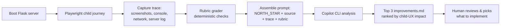

# Pick-a-Page Improvement Loop — Design Spec

> Status: Approved design, pending implementation plan.
> Date: 2026-07-29

## Summary

Build a local, Copilot-CLI-powered **improvement loop** for Pick-a-Page,
modelled on the "hill-climbing loop" (Level 4) from LangChain's *The Art of Loop
Engineering*. Each run drives the real app through a child's full user
experience with Playwright, captures a structured trace, grades it against a
deterministic rubric, then asks an analysis model for the **top 3 improvements**
ranked by impact on a child's fun and ease-of-use.

The loop is a separate harness under `loop/`. It **observes** the app in
`backend/`; it never modifies application code. A human reviews the improvements
and decides what to implement — each cycle raises the bar.

## North Star

> **Pick-a-Page helps children (8+) learn to write Markdown by making it fun.**
> Every run is judged first on the child's experience: is it delightful,
> obvious, and rewarding to use? Education is the vehicle; fun and ease-of-use
> are the goal.

This is stored, version-controlled, in `loop/NORTH_STAR.md` so it can evolve.
The analysis model grades every run against it.

### Rubric weighting (highest to lowest)

1. **Fun & delight** — does it feel playful and rewarding for a child?
2. **Ease of use / low friction** — can an 8-year-old proceed without help?
3. **Clarity of the Markdown-learning journey** — does the child learn Markdown naturally?
4. **Correctness & quality** — compiles cleanly, no broken choices, accessible, mobile-first, tests pass.

## Why this approach (Approach B — Python loop harness)

A proficient AI loop engineer separates the harness from the app, codifies a
rubric, captures real traces, and keeps a human gate on changes. Approach B
delivers that while staying local and Copilot-CLI-powered (no LangSmith
dependency or cost). It stacks two loops from the article:

- **Verification loop (Level 2):** a deterministic grader catches whole classes
  of error before any model call.
- **Hill-climbing loop (Level 4):** an analysis model reads the trace + rubric +
  north-star and proposes harness improvements; a human applies them.

Rejected alternatives:
- **Approach A (bash loop):** matches the sibling repo but bash orchestrating a
  server + browser is fiddly and the trace is loosely structured.
- **Approach C (LangChain/LangGraph + LangSmith):** textbook, but heavy
  dependency, API keys/cost, and overkill for a kids' Flask app.

## Architecture

The app in `backend/` is never touched by the loop. The harness only observes.

```
loop/
├── NORTH_STAR.md          # product north star + rubric (the "vision")
├── config.py              # model tiers + settings (env-overridable)
├── run.py                 # orchestrator: capture -> verify -> analyze
├── journey.py             # Playwright child-user journey (the full UX)
├── rubric.py              # deterministic grader (Level 2 verification)
├── analyze.py             # assembles prompt, calls Copilot CLI (Level 4)
├── prompt.md              # analysis instructions ("top 3 improvements")
└── artifacts/             # gitignored: traces, screenshots, reports per run
    └── 2026-07-29-HHMMSS/
        ├── screenshots/*.png
        ├── console.log
        ├── network.json
        ├── server.log
        ├── rubric.json
        └── improvements.md
```

## Data flow

One invocation: `python -m loop.run` (or `make loop`).



## Components

### `journey.py` — the full user experience

Playwright drives the real UI the way a child would, capturing a screenshot at
each step:

1. Land on the app (first impression).
2. Start a story from a template.
3. Type a bit of Markdown in the editor.
4. Compile it.
5. Play the story and click through a choice.
6. Switch language (i18n).

Console errors, failed network calls, and server logs are recorded throughout as
the trace signal the analysis model reasons over. The journey is resilient: a
step that fails is recorded as a failure in the trace (with screenshot) rather
than aborting the whole run, so the analysis still gets signal.

### `rubric.py` — deterministic grader (runs before the model)

Pass/fail checks recorded to `rubric.json`:

- Flask server booted and served the app.
- No uncaught JS console errors during the journey.
- No 4xx/5xx on core API calls.
- Sample story compiles (text -> HTML) without error.
- No broken `[[choices]]` in the compiled sample.
- All journey steps reached.
- `pytest` passes and coverage is at or above the configured threshold.

Results feed the prompt so the model spends its attention on judgment and taste,
not mechanical bugs.

### `analyze.py` — the hill-climb

Assembles `NORTH_STAR.md` + app source + the run trace + rubric results into a
single prompt (see `prompt.md`), then calls the Copilot CLI, mirroring the
sibling repo's pattern:

```
copilot -p "<assembled prompt>" --model "<model>" --no-color
```

Returns **exactly the top 3 improvements**, each:
- ranked by impact on a child's fun / ease-of-use,
- tied to concrete evidence from the trace or rubric,
- with a concrete first step to implement it.

Output is saved to the run's `improvements.md` and printed to the console.

### `config.py` — model tiers (easy strong/cheap switching)

Three named tiers, all **included in the Copilot Pro ($10/mo) plan**. Billing is
now per-token via GitHub AI Credits (1 credit = $0.01) once the monthly
allowance is used — GitHub retired the old premium-request multipliers. Prices
below are per 1M tokens (input / output):

- `cheap` — `gpt-5-mini` ($0.25 / $2.00): cheapest capable Pro model, multimodal
  (can read the journey screenshots), GitHub's recommended general default.
- `balanced` — `claude-sonnet-4.5` ($3.00 / $15.00): stronger reasoning and
  writing taste.
- `strong` — `gpt-5.4` ($2.50 / $15.00): deep multi-step reasoning / analysis.

**Default policy:** the default tier is `cheap` (`gpt-5-mini`) — the cheapest
model that still delivers good quality on this analysis task, not the absolute
cheapest. Model ids must match the slugs your Copilot CLI accepts; verify with
`copilot --help` and adjust if a run reports an unknown model.

Selection precedence (highest wins):

1. `LOOP_MODEL` env var — an explicit model id, overrides everything.
2. `LOOP_TIER` env var — `cheap` | `balanced` | `strong`, selects a tier's model id.
3. Default tier (`cheap`) in `config.py`.

Example:

```bash
make loop                    # default: cheap tier (gpt-5-mini, cheapest-that-works)
LOOP_TIER=balanced make loop
LOOP_TIER=strong make loop
LOOP_MODEL=some-model make loop
```

Other settings in `config.py`: server host/port, coverage threshold, journey
base URL, artifacts directory.

## Ergonomics

- `make loop` runs capture -> verify -> analyze end to end and prints the top 3.
- Artifacts are timestamped per run and gitignored, so runs accumulate as a
  history you can diff over time.
- `loop/artifacts/` is added to `.gitignore`.

## Testing

- Unit-test `rubric.py` checks with synthetic trace fixtures (pass and fail
  cases) — no server or browser needed.
- Unit-test `config.py` model-selection precedence (env overrides, tier
  mapping, default).
- The journey and orchestrator are exercised by a smoke run rather than mocked
  Playwright; keep them thin so most logic lives in testable pure functions.

## Out of scope (YAGNI for now)

- Event-driven triggers (cron/webhook) — the article's Level 3. Can be added
  later by scheduling `make loop`.
- Auto-applying improvements — a human implements them. The loop proposes; it
  does not self-modify the app.
- LangSmith / external tracing platforms.
```